# Secure Login System

A production-style Flask authentication project designed for cybersecurity portfolios, internship demonstrations, academic mini projects, and resume showcases. This application focuses on implementing secure authentication mechanisms and modern web security best practices.

---

## Features

* Secure user registration system
* Duplicate email prevention
* Strong password validation policy
* bcrypt password hashing with automatic salting
* Secure login authentication
* Generic login error messages
* Account lockout after repeated failed attempts
* Flask-Login session management
* Secure logout functionality
* Protected dashboard and profile routes
* CSRF protection using Flask-WTF
* HTTPOnly and SameSite session cookie settings
* Optional Google Authenticator compatible TOTP 2FA
* Password reset token flow
* Remember me functionality
* Login history tracking
* Responsive Bootstrap 5 UI

---

## Tech Stack

| Technology   | Purpose                   |
| ------------ | ------------------------- |
| Python       | Backend programming       |
| Flask        | Web framework             |
| SQLite       | Database                  |
| Flask-Bcrypt | Password hashing          |
| Flask-Login  | Session management        |
| Flask-WTF    | Form validation & CSRF    |
| Bootstrap 5  | Responsive frontend       |
| pyotp        | Two-Factor Authentication |

---

## Project Structure

```bash
CYBERSECURELOGIN/
│
├── routes/
├── demo/
│   └── secure-login-demo.mp4
│
├── screenshots/
│   ├── 2fa.png
│   ├── 2fa1.png
│   ├── dashboard.png
│   ├── folder.png
│   ├── login.png
│   ├── logout.png
│   ├── profile.png
│   ├── register1.png
│   ├── register2.png
│   ├── secure_login.png
│   ├── set_2fa.png
│   └── set_2fa1.png
│
├── static/
│
├── templates/
│   ├── base.html
│   ├── dashboard.html
│   ├── forgot_password.html
│   ├── login.html
│   ├── profile.html
│   ├── register.html
│   ├── reset_password.html
│   ├── setup_2fa.html
│   └── verify_2fa.html
│
├── utils/
│
├── .env
├── .gitignore
├── app_factory.py
├── app.py
├── README.md
└── requirements.txt
```

---

## Project Demo

Complete application demonstration video:

[Watch Demo Video](demo/secure-login-demo.mp4)
---

## Installation

```bash
git clone <your-github-repo-link>
cd CYBERSECURELOGIN

python -m venv .venv

.venv\Scripts\activate

pip install -r requirements.txt

python app.py
```

Open the application in browser:

```text
http://127.0.0.1:5000
```

---

## Environment Variables

Configure `.env` file:

```text
SECRET_KEY=use-a-long-random-secret-here
DATABASE_URL=sqlite:///database.db
SESSION_COOKIE_SECURE=False
SESSION_MINUTES=30
```

Set:

```text
SESSION_COOKIE_SECURE=True
```

when deploying with HTTPS.

---

## Authentication Workflow

1. User registers with validated credentials
2. Password is hashed using bcrypt before storage
3. User logs in securely using hashed password verification
4. Flask session is created securely
5. Optional TOTP 2FA verification is performed
6. Protected routes become accessible
7. Session is destroyed securely on logout

---

## How Security Works

### Password Security

Passwords are never stored in plain text. The application uses `Flask-Bcrypt` to hash passwords with automatic salting before storing them in the database.

### SQL Injection Protection

SQL injection attacks are prevented using SQLAlchemy ORM queries and parameterized database operations. Raw SQL string concatenation is avoided.

### CSRF Protection

CSRF protection is enabled globally using Flask-WTF. Every sensitive form request includes secure CSRF tokens.

### Session Security

The application uses:

* Flask-Login session management
* HTTPOnly cookies
* SameSite cookie policy
* Configurable secure cookies
* Controlled session expiration

### Account Lockout

After multiple failed login attempts, the account is temporarily locked to reduce brute-force attacks.

### Two-Factor Authentication

2FA is implemented using `pyotp` and Google Authenticator compatible TOTP verification codes.

### Password Reset

Password reset functionality uses signed and time-limited tokens through `itsdangerous`.

---

## Threats Mitigated

This project helps reduce common web authentication attacks including:

* SQL Injection
* Brute Force Attacks
* Weak Password Attacks
* Session Hijacking
* CSRF Attacks
* Unauthorized Dashboard Access
* Plain Text Password Storage

---

## Security Best Practices Implemented

* Secure password hashing using bcrypt
* Strong password policy validation
* Secure session cookie configuration
* CSRF token validation
* ORM-based database queries
* Generic authentication error handling
* Token expiration mechanisms
* Protected authentication routes

---

## Screenshots

### 1. User Registration Page
The registration page allows users to create secure accounts with password policy validation and duplicate email prevention.

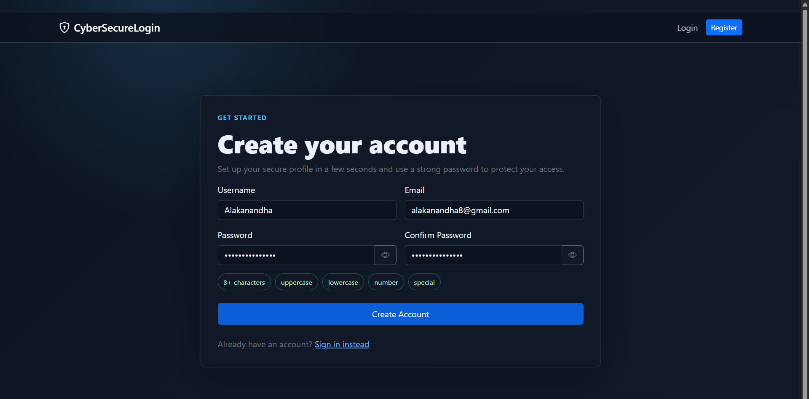

---

### 2. Registration Validation
This screen demonstrates secure input validation and strong password requirement enforcement during user registration.

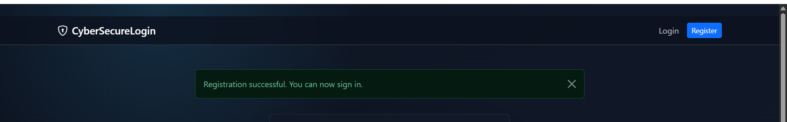

---

### 3. Secure Login Page
The login page implements secure authentication with bcrypt password verification, CSRF protection, and session handling.

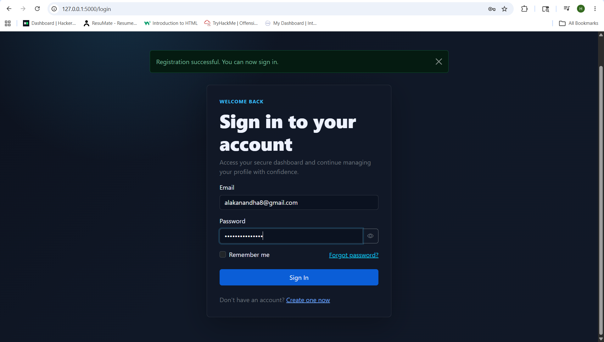

---

### 4. Secure Dashboard
The dashboard is protected and accessible only after successful user authentication.

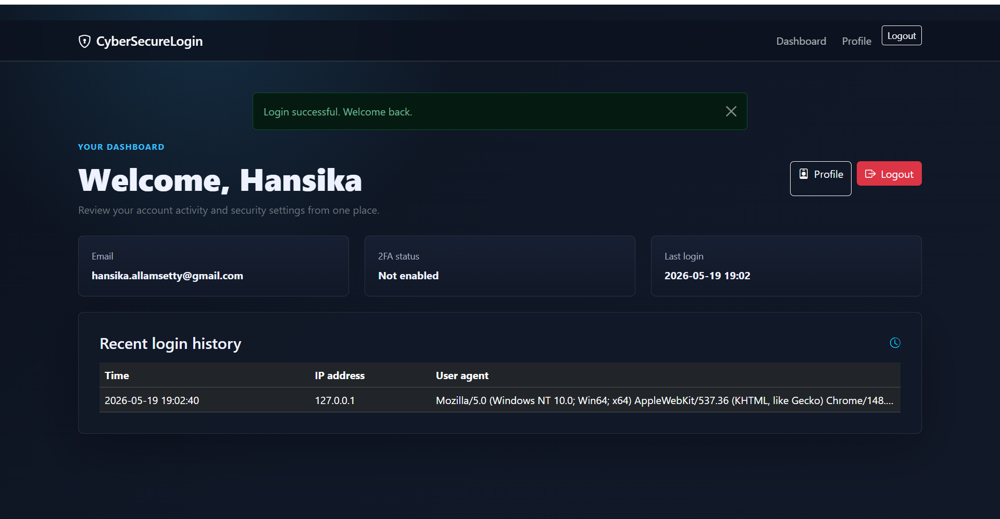

---

### 5. User Profile Page
The profile page allows users to manage account settings and security configurations.

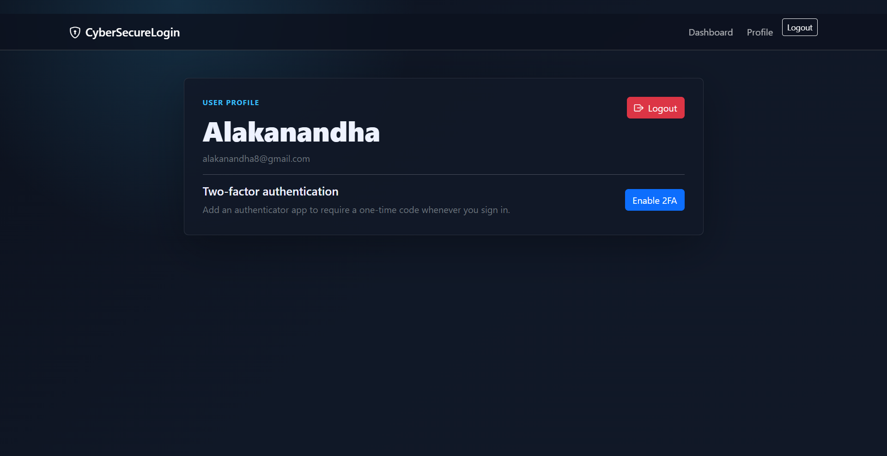

---

### 6. Two-Factor Authentication Setup
Users can enable Google Authenticator compatible TOTP-based Two-Factor Authentication for enhanced account security.

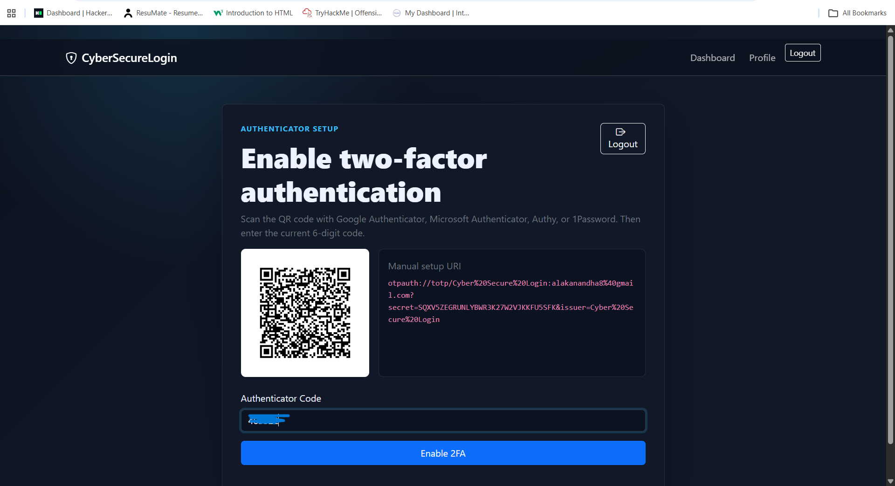

---

### 7. Additional 2FA Configuration
Additional configuration workflow for enabling and managing Two-Factor Authentication.

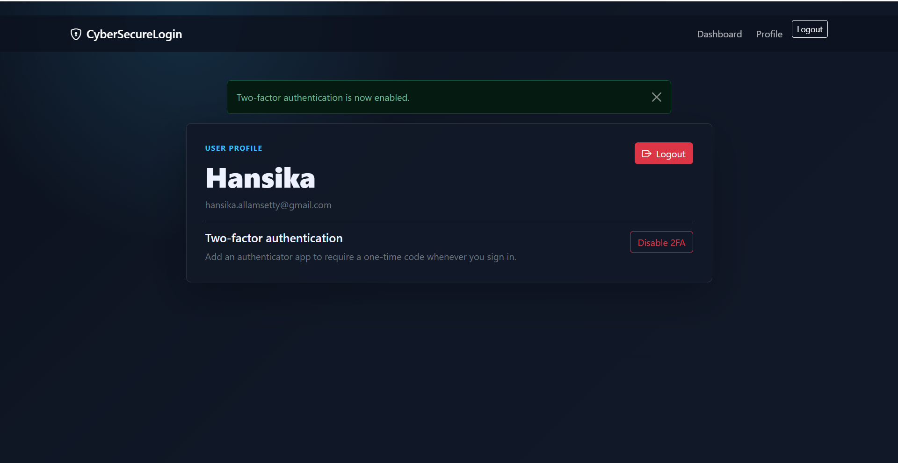

---

### 8. Secure Logout Workflow
The logout functionality securely destroys active sessions and prevents unauthorized session reuse.

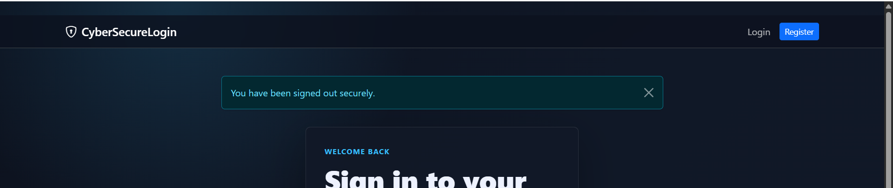

---

### 9. Complete Application Preview
Overall preview of the Secure Login System application interface.

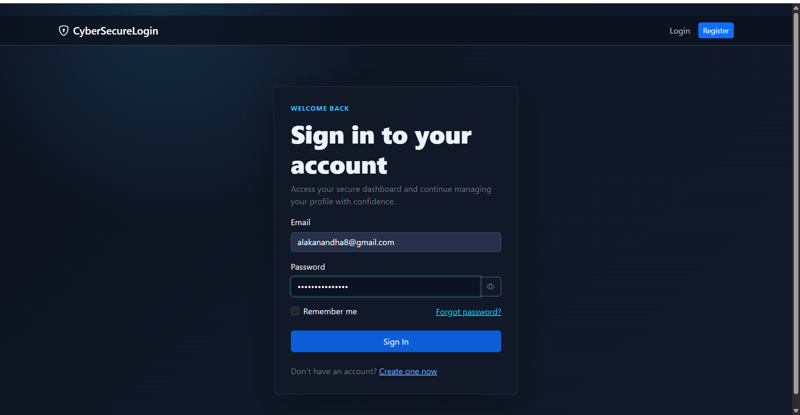

---

### 10. Two-Factor Authentication Verification
Users must verify their identity using a secure 6-digit TOTP verification code during login.

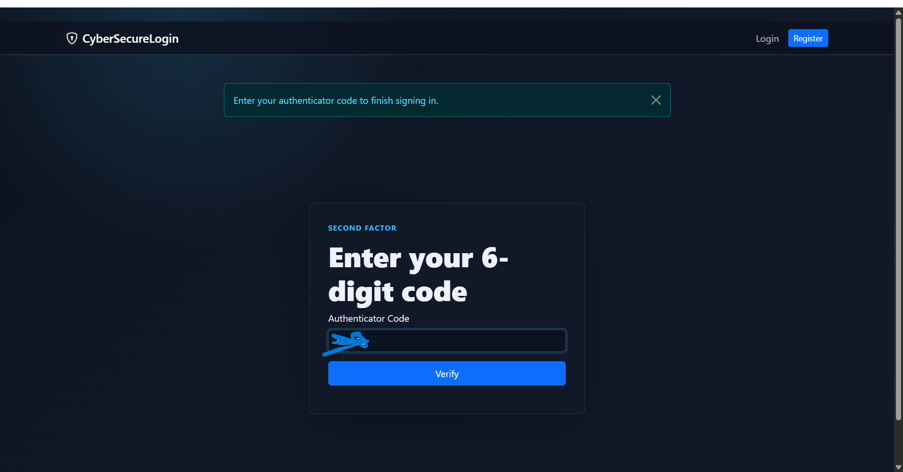

---

### 11. Additional 2FA Verification Screen
Additional authentication verification workflow screen for enhanced account protection.

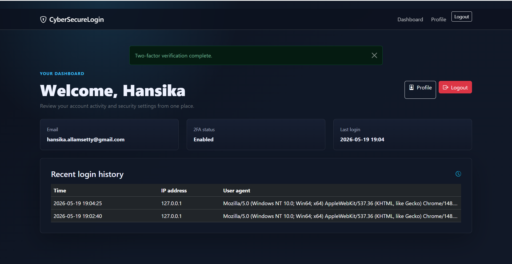


### 12. Complete Project Folder Structure
The project follows a modular and organized Flask application structure for maintainability and scalability.

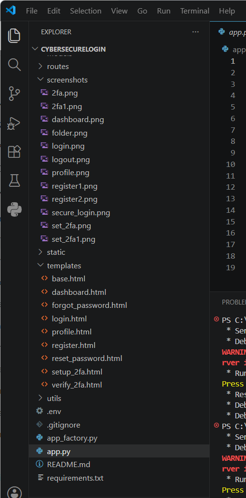

---


## Learning Outcomes

Through this project, I gained practical experience with:

* Secure authentication system development
* Password hashing using bcrypt
* Session and cookie security
* CSRF protection implementation
* SQL injection prevention
* Flask backend architecture
* Two-Factor Authentication integration
* Secure coding practices

---

## Future Improvements

* Add QR code rendering for TOTP setup
* Add SMTP email integration
* Add Flask-Limiter for IP-based rate limiting
* Add Content Security Policy headers
* Add automated testing with pytest
* Add Docker deployment support
* Add production WSGI deployment configuration

---

## Portfolio Use

This project was developed to demonstrate practical cybersecurity and secure authentication concepts for internships, GitHub portfolios, resume projects, and academic submissions.

---

## Conclusion

This project demonstrates how secure authentication systems can be implemented using Flask and modern cybersecurity best practices. It combines usability with strong defensive mechanisms to protect authentication workflows and user accounts.
